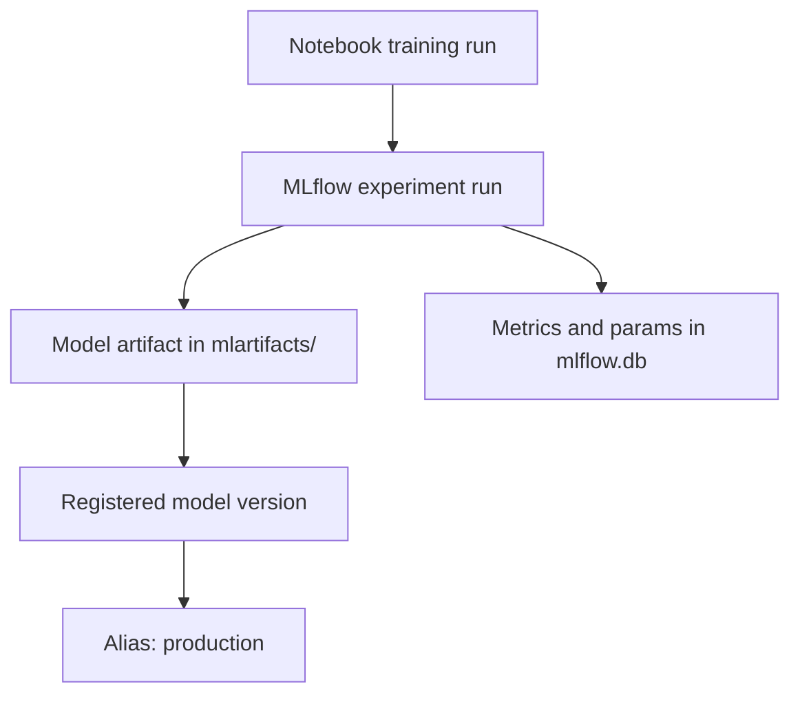
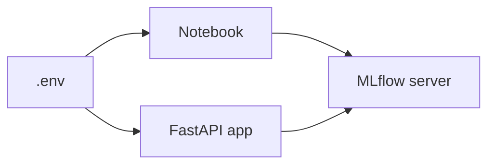

# Run MLflow Locally

This step sets up the local service that both the notebook and the FastAPI application use. The goal is to keep the whole deployment workflow on your machine without depending on any remote artifact storage.

## What this service does

The local MLflow server gives you:

- experiment tracking on <http://127.0.0.1:5000>,
- a local Model Registry,
- artifact storage in the `mlartifacts/` folder,
- a SQLite metadata database in `mlflow.db`.



## Start the tracking server

From the repository root, run:

```bash
uv run mlflow server \
  --host 127.0.0.1 \
  --port 5000 \
  --backend-store-uri sqlite:///mlflow.db \
  --default-artifact-root ./mlartifacts \
  --allowed-hosts "localhost:5000,127.0.0.1:5000,host.docker.internal:5000"
```

`--allowed-hosts` lists the addresses the server accepts requests from. MLflow blocks unknown hosts by default, so `host.docker.internal:5000` is added here to let the Docker container from step `04` reach the server.

> **Linux users without Docker Desktop:** start the server with `--host 0.0.0.0` instead of `--host 127.0.0.1`. With plain Docker Engine, the container reaches your machine through the Docker network rather than `127.0.0.1`, so the server must listen on all interfaces. Only do this on a trusted network, because other devices on it can then reach the server too.

Keep this terminal window open while you work through the notebook and the API.

Expected result:

- The terminal stays busy because the MLflow server is running.
- The MLflow UI is available at <http://127.0.0.1:5000>.
- `mlflow.db` is created in the repository root.
- `mlartifacts/` appears after the notebook logs the model.

## Check the environment file

You created `.env` from `.env.example` during the [README Setup](README.md#setup). The default values already point to the local tracking server:

- `MLFLOW_TRACKING_URI=http://127.0.0.1:5000`
- `REGISTERED_MODEL_NAME=lr-ride-duration`
- `MODEL_ALIAS=production`



### Quick Sanity Checks

After setup:

- Open `.env` and confirm the values still point to `http://127.0.0.1:5000`.
- Keep all commands in this repo rooted from the project directory.

## Run the notebook

Open [src/register_mlflow_model.ipynb](src/register_mlflow_model.ipynb) and select the `.venv` environment created by `uv sync` as the notebook kernel.

The notebook is intentionally small and runnable:

1. it builds a compact demo dataset,
2. trains a scikit-learn regression pipeline,
3. logs the model to MLflow,
4. registers the model and assigns the `production` alias.

The alias is the key handoff to the API. The service does not load "the last model trained" but the model version currently marked as `production`.

Once the notebook finishes, you should see the registered model in the MLflow UI under `Models`.

If the notebook cannot find the `.venv` kernel, restart the editor after running `uv sync` and select the interpreter again from the notebook toolbar.

The notebook loads `.env` from the repository root whether the kernel starts in the root folder or inside `src/`.
