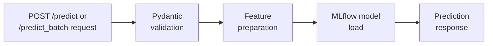
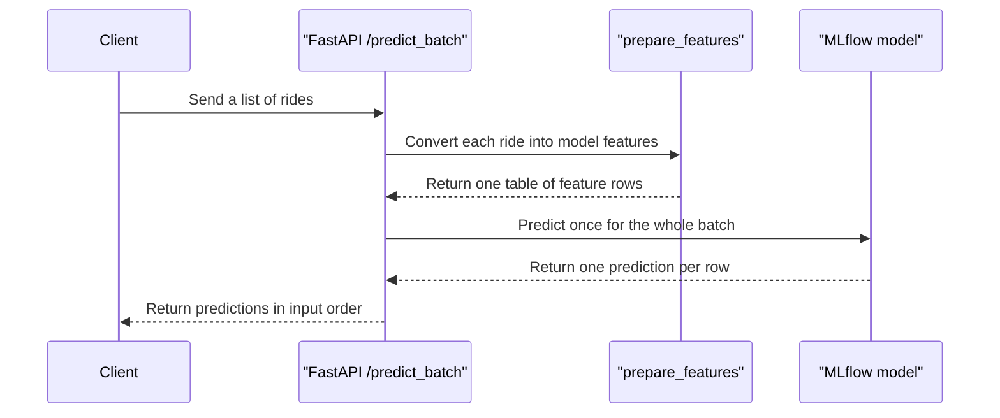

# Run the FastAPI App Locally

Now that the model is registered in local MLflow, you can serve predictions from a local FastAPI application.

## API files

The local API lives in the [webservice_locally](webservice_locally) folder:

- [app.py](webservice_locally/app.py) defines the FastAPI routes,
- [data_model.py](webservice_locally/data_model.py) defines the request and response schemas with Pydantic,
- [predict.py](webservice_locally/predict.py) loads `lr-ride-duration@production` from the local MLflow registry and returns single or batch predictions.



## Routes at a glance

| Route | Input | Output | Use it when |
| --- | --- | --- | --- |
| `GET /` | No body | Project health message | Checking that the app is alive |
| `POST /predict` | One taxi ride | One ride plus `predicted_duration` | Scoring a single example |
| `POST /predict_batch` | List of taxi rides | List of predictions in request order | Scoring several examples together |

If you send an empty list to `POST /predict_batch`, the API returns `[]`. That keeps the behavior predictable for callers that build requests dynamically.

## Start the API

From the repository root, run:

```bash
uv run uvicorn webservice_locally.app:app --reload --port 9696
```

Once the server is running, open <http://127.0.0.1:9696/docs> to inspect the interactive API documentation.

If a prediction request fails with a model-loading error, go back to step `01` and confirm that:

- the MLflow server is still running,
- the notebook finished successfully,
- the registered model has the `production` alias.

After these checks, send the request again. You do not need to restart the API, because it loads the model from MLflow each time a prediction request runs.

## Example request

```bash
curl -X POST http://127.0.0.1:9696/predict \
  -H "Content-Type: application/json" \
  -d '{
    "ride_id": "ride-101",
    "PULocationID": 161,
    "DOLocationID": 236,
    "trip_distance": 3.5
  }'
```

## Expected response shape

The exact prediction value will vary depending on the model version you registered, but the response will look like this:

```json
{
  "ride_id": "ride-101",
  "PULocationID": 161,
  "DOLocationID": 236,
  "trip_distance": 3.5,
  "predicted_duration": 16.88
}
```

## Batch prediction request

Use `POST /predict_batch` when you want to score several rides in one request:

```bash
curl -X POST http://127.0.0.1:9696/predict_batch \
  -H "Content-Type: application/json" \
  -d '[
    {
      "ride_id": "ride-201",
      "PULocationID": 161,
      "DOLocationID": 236,
      "trip_distance": 3.5
    },
    {
      "ride_id": "ride-202",
      "PULocationID": 142,
      "DOLocationID": 239,
      "trip_distance": 1.7
    }
  ]'
```

The response is a list with one prediction object per input ride, in the same order.



## Suggested local checks

- Visit `GET /` to confirm the app is running.
- Use `/docs` to inspect the request schema.
- Try a few different `trip_distance` values and compare the predicted durations.
- Try `POST /predict_batch` and confirm the response order matches the request order.
- Run [03-test-the-api.md](03-test-the-api.md) before making code changes.
