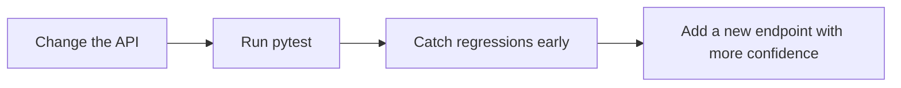

# Test the API

Once the notebook, MLflow server, and FastAPI app work together locally, the next useful step is to protect the workflow with a couple of tests.

## Why this step matters

The earlier steps prove the project works. This step helps you keep it working if you want to make changes or add new endpoints in the future.



## Included test file

This repository includes [tests/test_app.py](tests/test_app.py):

- One test checks that `GET /` returns the expected message.
- One test checks that `POST /predict` returns the original payload plus a prediction field.
- One test checks that `POST /predict_batch` returns one prediction per input ride.
- One test checks that an empty batch returns an empty response without loading a model.

The prediction tests mock the model calls so they do not depend on a running MLflow server. That keeps the tests fast and focused on API behavior.

## Run the tests

From the repository root, run:

```bash
uv run python -m pytest
```

`python -m pytest` (rather than plain `pytest`) adds the repository root to the import path, so the tests can import the `webservice_locally` package.

Expected result:

- All four tests pass.
- The output ends with a short `4 passed` summary.

## What the tests cover

| Area | What it checks | Why it helps |
| --- | --- | --- |
| `GET /` | The app starts and responds with the expected message | Confirms the API entrypoint is wired correctly |
| `POST /predict` | The route accepts a valid payload and returns `predicted_duration` | Confirms request parsing and response formatting work |
| `POST /predict_batch` | The route accepts a list and preserves response order | Confirms batch requests stay aligned with input rides |
| `POST /predict_batch` with `[]` | The route returns `[]` without loading a model | Keeps empty requests cheap and predictable |

## Deliverable checklist

If you update the API, aim to leave the repository in this state:

- The route appears in `/docs`.
- `uv run python -m pytest` still passes.
- The behavior is described in the relevant markdown file.
- The change still works with the local MLflow setup from steps `01` and `02`.
