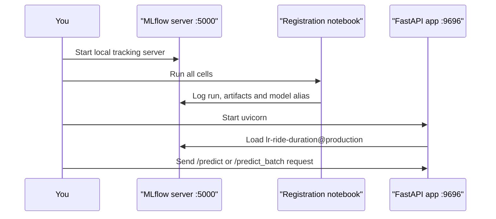
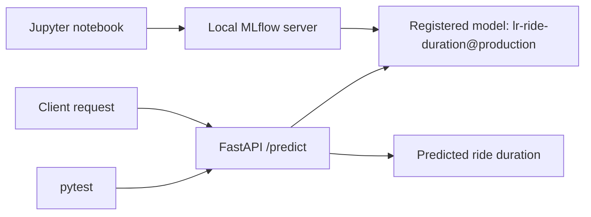

# Deploy a Local ML Model API with FastAPI, MLflow and Docker

This repository shows a local-first deployment workflow for a Machine Learning model. You will create and register a small demo taxi-duration model in MLflow, serve it through a FastAPI application, test the API locally, and package it in Docker once the core flow works.

## Learning Objectives

By the end of this repository, you should be able to:

- Explain how MLflow tracking and the Model Registry support local deployment workflows.
- Run a FastAPI application that serves predictions from a registered model.
- Use Pydantic to structure and validate request and response payloads.
- Write small smoke tests for an API route before making larger changes.
- Package the API in Docker and connect it to services running on your machine.

## Learning Path

The workflow has three moving parts. Keep each long-running service in its own terminal so it is easy to read logs and stop processes cleanly with `Ctrl + C`.



| File / Folder | Description |
|---|---|
| [**01 - Run MLflow Locally**](01-run-local-mlflow.md) | Start a local MLflow tracking server with a SQLite backend and local artifact storage. |
| [**02 - Run the API Locally**](02-run-the-api-locally.md) | Start the FastAPI application and send single and batch prediction requests. |
| [**03 - Test the API**](03-test-the-api.md) | Run the smoke tests that protect the API routes. |
| [**04 - Run the API in Docker**](04-run-with-docker.md) | Build and run the API in Docker against the same local MLflow server. |

### Additional Folders and Files

| File / Folder | Description |
|---|---|
| [**src**](src/) | Notebook that trains, logs and registers the `lr-ride-duration@production` demo model. |
| [**tests**](tests/) | Smoke tests for the API routes. |
| [**webservice_locally**](webservice_locally/) | FastAPI routes, Pydantic schemas and MLflow prediction helpers. |
| [**Dockerfile**](Dockerfile) | Container image definition for the API. |
| [**pyproject.toml**](pyproject.toml) | Project configuration and dependencies. |
| [**uv.lock**](uv.lock) | Dependency lock file. |

## Local Data Services

This repository uses one local data service:

- `MLflow tracking server` on <http://127.0.0.1:5000>. It stores experiment metadata in `mlflow.db` and model artifacts in `mlartifacts/`.

The FastAPI app runs locally on <http://127.0.0.1:9696> and loads the registered model from the MLflow Model Registry using the `production` alias.



## Prerequisites

- **Docker Desktop**: required to build and run the API container in step 04. Follow the [installation instructions](https://docs.docker.com/get-docker/) if you do not have it yet. Make sure it is **installed and running** before you start that step.

> [!NOTE]
> **Windows Users:** The commands in this walkthrough use bash syntax. Use **Git Bash** (installed with [Git for Windows](https://git-scm.com/downloads/win)) instead of PowerShell to run them.

## Setup

> [!NOTE]
> Throughout these steps, text in angle brackets like `<repo-name>` is a **placeholder**. Replace it, including the `< >` brackets, with your own value. For example, `cd <repo-name>` becomes `cd mle-api-ml-deployment`.

### 1. Use This Repository as a Template

Click **Use this template** on GitHub.

When creating the repository:

- Set yourself as the **Owner**
- Choose a repository name
- Disable **Include all branches**
- Click **Create repository**

> [!IMPORTANT]
> If you are working in pairs or groups, only **one person** should complete this step.

---

### 2. Add Collaborators (Pairs/Groups Only)

If working with teammates:

1. Open the repository on GitHub
2. Go to **Settings → Collaborators**
3. Add your teammates as collaborators
4. Share the repository link with your team

Teammates should accept the invitation before continuing.

---

### 3. Clone Your Copy

Copy the SSH URL from the **Code** button on GitHub, then run:

```bash
git clone <copied-ssh-url>
```

The copied SSH URL will look like `git@github.com:<your-username>/<repo-name>.git`.

---

### 4. Move into the Project Folder and Install Dependencies

This installs all dependencies and creates a virtual environment in `.venv/`.

```bash
cd <repo-name>
uv sync
```

---

### 5. Create the Environment File

Copy the template once:

```bash
cp .env.example .env
```

The default values already point to the local MLflow server, and both the notebook and the FastAPI app read them:

- `MLFLOW_TRACKING_URI=http://127.0.0.1:5000`
- `REGISTERED_MODEL_NAME=lr-ride-duration`
- `MODEL_ALIAS=production`

> [!CAUTION]
> Never commit `.env`. It is git-ignored because environment files often hold secrets. Only `.env.example`, with placeholder or default values, belongs in the repository.

---

### 6. Open the Repository in VS Code

> [!NOTE]
> Make sure you open VS Code from the project root so it automatically detects the environment created by `uv sync`.

Launch VS Code in the project root folder:

```bash
code .
```

Then open [src/register_mlflow_model.ipynb](src/register_mlflow_model.ipynb) and select the Python environment created by `uv sync` as the kernel.

## End-To-End Checklist

Use this checklist when you want to confirm the repository is healthy from a clean local state:

| Check | Command or page | Healthy result |
| --- | --- | --- |
| Local config | `.env` | Points to `http://127.0.0.1:5000` |
| MLflow UI | <http://127.0.0.1:5000> | Opens and shows the local tracking server |
| Model Registry | MLflow `Models` page | `lr-ride-duration` has the `production` alias |
| API docs | <http://127.0.0.1:9696/docs> | Shows `/predict` and `/predict_batch` |
| Tests | `uv run python -m pytest` | Ends with `4 passed` |

## References & Further Reading

- [Testing FastAPI Apps](https://fastapi.tiangolo.com/tutorial/testing/): How `TestClient` works, as used in the smoke tests.
- [MLflow Tracking Server](https://mlflow.org/docs/latest/self-hosting/architecture/tracking-server): How the tracking server, backend store and artifact store fit together.
- [MLOps Zoomcamp: Model Deployment](https://github.com/DataTalksClub/mlops-zoomcamp/tree/main/04-deployment): An open course module that deploys a taxi-duration model as a web service.
