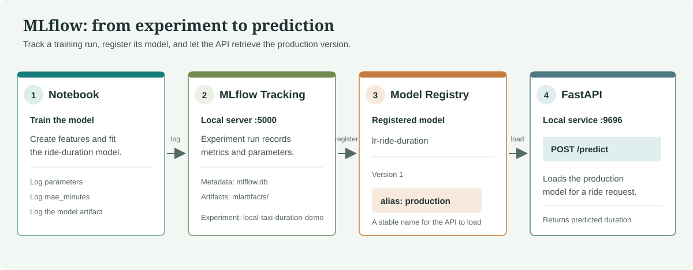

# The Fundemantal Prerequisites

## Section 1: Understanding Modeling, Model and Training

  <input class="slide-choice" type="radio" name="prerequisite-slide" id="prereq-slide-1" aria-label="Slide 1: Modelling" checked>
  <input class="slide-choice" type="radio" name="prerequisite-slide" id="prereq-slide-2" aria-label="Slide 2: Modelling and Model">
  <input class="slide-choice" type="radio" name="prerequisite-slide" id="prereq-slide-3" aria-label="Slide 3: Modelling, Model and Training">
  <input class="slide-choice" type="radio" name="prerequisite-slide" id="prereq-slide-4" aria-label="Slide 4: Service" />

  <section class="slide slide-one" aria-label="Slide 1">
    

      
Modelling

    

    <nav class="navigation" aria-label="Slide navigation">
      <button class="previous" type="button" disabled>Previous</button>
      <label class="next" for="prereq-slide-2">Next</label>
    </nav>
  </section>

  <section class="slide slide-two" aria-label="Slide 2">
    

      
Modelling

      
Model

    

    <nav class="navigation" aria-label="Slide navigation">
      <label class="previous" for="prereq-slide-1">Previous</label>
      <label class="next" for="prereq-slide-3">Next</label>
    </nav>
  </section>

  <section class="slide slide-three" aria-label="Slide 3">
    

      
Modelling

      
Model

      
Training

    

    <nav class="navigation" aria-label="Slide navigation">
      <label class="previous" for="prereq-slide-2">Previous</label>
      <label class="next" for="prereq-slide-4">Next</label>
    </nav>
  </section>

  <section class="slide slide-four" aria-label="Slide 4">
    

      
Modelling

      
Model

      
Training

    

    
Service

    <nav class="navigation" aria-label="Slide navigation">
      <label class="previous" for="prereq-slide-3">Previous</label>
    </nav>
  </section>

## Section 2: Classification and Regression Metrics

  <input class="slide-choice" type="radio" name="metric-slide" id="metric-slide-1" aria-label="Classification metrics" checked>
  <input class="slide-choice" type="radio" name="metric-slide" id="metric-slide-2" aria-label="Regression metrics">

  <section class="slide classification-slide" aria-label="Classification metrics slide">
    <h3>Classification metrics</h3>
    

      <table>
        <thead>
          <tr><th>Metric</th><th>What it answers</th><th>When to use</th></tr>
        </thead>
        <tbody>
          <tr><td>Accuracy</td><td>What percentage of predictions were correct?</td><td>Classes are roughly balanced</td></tr>
          <tr><td>Precision</td><td>When the model says "yes," how often is it right?</td><td>False alarms are costly</td></tr>
          <tr><td>Recall</td><td>Of all real "yes" cases, how many were caught?</td><td>Missing a case is costly (disease, fraud)</td></tr>
          <tr><td>F1 score</td><td>Balance of precision and recall</td><td>Both matter, or classes are imbalanced</td></tr>
          <tr><td>Confusion matrix</td><td>Table of right and wrong predictions by type</td><td>Always worth checking</td></tr>
          <tr><td>ROC-AUC</td><td>How well the model separates the classes (0.5 = random, 1.0 = perfect)</td><td>Comparing models</td></tr>
          <tr><td>Log loss</td><td>Punishes confident wrong predictions</td><td>You care about probabilities</td></tr>
        </tbody>
      </table>
    

    
<strong>Accuracy trap:</strong> with 99 normal transactions and 1 fraud, "always say not fraud" gets 99% accuracy but catches zero fraud.

    <nav class="navigation" aria-label="Metric slide navigation">
      <button class="previous" type="button" disabled>Previous</button>
      <label class="next" for="metric-slide-2">Next</label>
    </nav>
  </section>

  <section class="slide regression-slide" aria-label="Regression metrics slide">
    <h3>Regression metrics</h3>
    

      <table>
        <thead>
          <tr><th>Metric</th><th>What it answers</th><th>When to use</th></tr>
        </thead>
        <tbody>
          <tr><td>MAE</td><td>Average size of the error</td><td>Simple and explainable</td></tr>
          <tr><td>MSE</td><td>Average squared error</td><td>Big errors are especially bad</td></tr>
          <tr><td>RMSE</td><td>MSE converted back to original units</td><td>Most common choice</td></tr>
          <tr><td>R2</td><td>How much variation is explained (1 = perfect, 0 = no better than the average)</td><td>Overall "how good"</td></tr>
          <tr><td>MAPE</td><td>Average error in %</td><td>Comparing different scales</td></tr>
        </tbody>
      </table>
    

    <nav class="navigation" aria-label="Metric slide navigation">
      <label class="previous" for="metric-slide-1">Previous</label>
    </nav>
  </section>

## Section 3: How many types of models are there?

  

    <table>
      <thead>
        <tr><th>Family</th><th>Idea</th><th>Models</th></tr>
      </thead>
      <tbody>
        <tr><td>Linear</td><td>Best straight line</td><td>Linear Regression, Logistic Regression</td></tr>
        <tr><td>Tree-based</td><td>Yes/no questions</td><td>Decision Tree, Random Forest, Gradient Boosting (XGBoost, LightGBM)</td></tr>
        <tr><td>Distance-based</td><td>"You're like your neighbors"</td><td>K-Nearest Neighbors</td></tr>
        <tr><td>Probability-based</td><td>Probabilities of what goes together</td><td>Naive Bayes</td></tr>
        <tr><td>Margin-based</td><td>Widest gap between groups</td><td>SVM</td></tr>
        <tr><td>Neural networks</td><td>Layers of connected "neurons"</td><td>Deep learning</td></tr>
      </tbody>
    </table>
  

## Section 4: How many types of splitting are there?

  <h3>How many times you split</h3>
  

    <table>
      <thead>
        <tr><th>Type</th><th>How</th><th>Good for</th></tr>
      </thead>
      <tbody>
        <tr><td>Hold-out</td><td>One cut (80/20)</td><td>Large data, quick checks</td></tr>
        <tr><td>Train/val/test</td><td>Two cuts (60/20/20) &larr; <em>notebook</em></td><td>Decisions plus a final score</td></tr>
        <tr><td>K-fold CV</td><td>Rotate K parts</td><td>Small data</td></tr>
        <tr><td>Leave-one-out</td><td>K = number of rows</td><td>Tiny data</td></tr>
        <tr><td>Nested CV</td><td>CV inside CV</td><td>Very honest scores on small data</td></tr>
      </tbody>
    </table>
  

  <h3>How rows are chosen</h3>
  

    <table>
      <thead>
        <tr><th>Type</th><th>How</th><th>Use when</th></tr>
      </thead>
      <tbody>
        <tr><td>Random</td><td>Shuffle and cut</td><td>Independent rows, balanced classes</td></tr>
        <tr><td>Stratified &larr; <em>notebook</em></td><td>Keeps class proportions</td><td>Classification, rare classes</td></tr>
        <tr><td>Group</td><td>Same "thing" stays together</td><td>Several rows per person / item</td></tr>
        <tr><td>Time-based</td><td>Past &rarr; train, future &rarr; test</td><td>Data over time</td></tr>
      </tbody>
    </table>
  

## Section 5: Understanding Dockers and Containers enough

  <table>
    <thead>
      <tr><th>Term</th><th>What it is</th><th>PC comparison</th></tr>
    </thead>
    <tbody>
      <tr>
        <td><strong>Dockerfile</strong></td>
        <td>A text file with step-by-step build instructions: "start from Python, copy my code, install these libraries, run this command"</td>
        <td>A recipe, or the setup instructions an IT person follows to prepare a new PC</td>
      </tr>
      <tr>
        <td><strong>Image</strong></td>
        <td>The finished, frozen package built from the Dockerfile: your app plus everything it needs (libraries, settings, a minimal Linux file system). It can't be changed; it's read-only.</td>
        <td>A <strong>setup.exe / installer file</strong>, or even better, a <strong>ghost image / disk image</strong> of a fully prepared PC that you can copy onto any machine</td>
      </tr>
      <tr>
        <td><strong>Container</strong></td>
        <td>A <em>running</em> instance of an image. It is isolated from other containers and the host.</td>
        <td>A <strong>running program</strong> (a process you'd see in Task Manager), but in its own sealed room with its own files. You can start many containers from one image, like opening several windows of the same program.</td>
      </tr>
    </tbody>
  </table>

## Section 6: Understanding patterns

  <input class="slide-choice" type="radio" name="pattern-slide" id="pattern-slide-1" aria-label="Batch" checked>
  <input class="slide-choice" type="radio" name="pattern-slide" id="pattern-slide-2" aria-label="Batch and API">
  <input class="slide-choice" type="radio" name="pattern-slide" id="pattern-slide-3" aria-label="Batch, API and Streaming">

  <section class="slide pattern-one" aria-label="Batch">
    

      
Batch

    

    <nav class="navigation" aria-label="Pattern navigation">
      <button class="previous" type="button" disabled>Previous</button>
      <label class="next" for="pattern-slide-2">Next</label>
    </nav>
  </section>

  <section class="slide pattern-two" aria-label="Batch and API">
    

      
Batch

      
API

    

    <nav class="navigation" aria-label="Pattern navigation">
      <label class="previous" for="pattern-slide-1">Previous</label>
      <label class="next" for="pattern-slide-3">Next</label>
    </nav>
  </section>

  <section class="slide pattern-three" aria-label="Batch, API and Streaming">
    

      
Batch

      
API

      
Streaming

    

    <nav class="navigation" aria-label="Pattern navigation">
      <label class="previous" for="pattern-slide-2">Previous</label>
    </nav>
  </section>

## Section 7: Introduction to MLflow

